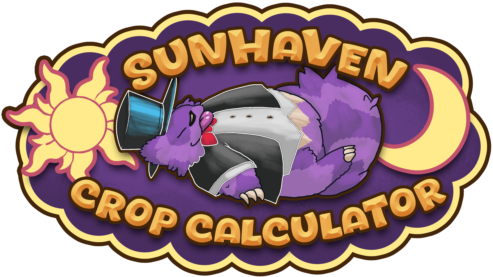

# Sun Haven Crop Calculator
This static webpage is a calculator that accepts numerous user-configured fields to calculate useful information regarding crops in Sun Haven. This calculator can be used to calculate:
* Total Profit from individual crop sales
* Daily ROI from individual crops
* How many harvested crops to expect over a period of time
* Total amount spent on seeds
* And more!

This calculator runs purely on HTML/Javascript/CSS. It employs the use of the [D3 javascript data-visualization library](https://d3js.org/) to illustrate information in a handy bar-chart.

This calculator does not use any testing libraries, CSS pre-processors, or templating frameworks.

Future plans for this calculator include but are not limited to:
1. Foreign language support
2. Improved search engine optimization
3. Removal of certain assumptions (listed in the disclaimers portion at the bottom of the calculator) upon developer confirmation
4. Implementation of new crops/mechanics released as part of Sun Haven V1.4

# To Install And Run

This calculator is live at [https://www.sunhavencrops.com](https://www.sunhavencrops.com) but can be run locally by downloading the project and opening the "index.html" file.

# Questions, Suggestions, Requests

Please reach out me directly by email at [8.bit.toolkit@gmail.com](mailto:8.bit.toolkit@gmail.com) or on my [reddit account](https://reddit.com/user/8_bit_toolkit).
